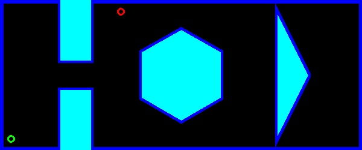
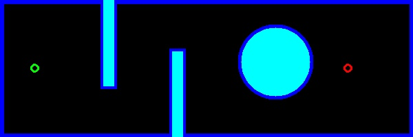

# ENPM-661-Project-3

## Phase 2
Mayank Sharma: 119203859
Yashveer Jain: 119252864

## Dependencies
* numpy
* matplotlib
* opencv-python
* queue
* argparse

## Steps to run the code
## Part 1
```
python3 Part1/Project3_Phase2_Part1.py --StartPos 18 18 90 --GoalPos 200 230--clearance 5 --RPM1 5 --RPM2 10
```
* Arguments:
    - StartPos contains value
        - x in px value in map location
        - y in px value in map location
        - $\theta$ between range [0, 360].
    - GoalPos contains value
        - x in px value in map location
        - y in px value in map location
    - clearance
        - int value
    - RPM1 : default - 5
        - int value
    - RPM2 : default - 10
        - int value

* Output:
    - `map.jpg`: Image of the map
    - `Phase2_Part1.avi` : Video of the exploration of the robot, till it reach the goal.
    


##  Map for part 1


## Sample Video Link for Part 1
- [Phase2_part1.avi](https://drive.google.com/file/d/1O4xHRhGfJXTYxNq2Lj6T4qztaF3rpl0i/view?usp=share_link)

## Part 2

* Steps to build the code
```
cp -r Phase2/Part2/Part2 ~/catkin_ws/src/.
cd ~/catkin_ws
catkin_make
source devel/setup.bash
cd src/
```

* To run the launch file
    * Input start and goal position in m

```
roslaunch Part2/launch/turtle_aStar.launch start_x_pos:=<input> start_y_pos:=<input> start_ang:=<input> goal_x_pos:=<input> goal_y_pos:=<input> clearance:=<input> rpm1:=<input> rpm2:=<input>
```
##  Map for part 2

    
## Output Video Links
* Test Case-
    - start position 0,0,0 (x,y input in m)
    - Goal Position 5,0 (x,y input in m)
    - Clearance 8
    - Rpm1 , Rpm2 = 8, 10 respectively 
    - Video:-
    [Phase2_part2_test_case1.avi](https://drive.google.com/file/d/1nVtHFtOykA8sLqd8hOYSPxYibGL8FaXJ/view?usp=share_link)

