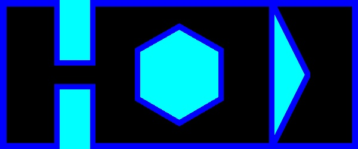

# ENPM-661-Project-3

## Phase 2
Mayank Sharma: 119203859
Yashveer Jain: 119252864

## Steps to run the code
## Part 1
```
python3 Part1/Project3_Phase2_Part1.py --StartPos 18 18 90 --GoalPos 200 230
```
* Arguments:
    - StartPos contains value
        - x in px value in map location
        - y in px value in map location
        - $\theta$ between range [0, 360].
    - GoalPos contains value
        - x in px value in map location
        - y in px value in map location
    - clearance
        - int value
    - RPM1 : default - 5
        - int value
    - RPM2 : default - 10
        - int value

* Output:
    - `map.jpg`: Image of the map
    - `Phase2_Part1.mp4` : Video of the exploration of the robot, till it reach the goal.
    

## Dependencies
* numpy
* matplotlib
* opencv-python

## Sample map


## Sample Video Link
- [Phase2_part1.avi](https://drive.google.com/drive/u/1/folders/1wN0if55JOjXX9yo0U5zaZNw3CgQh-qdb)


