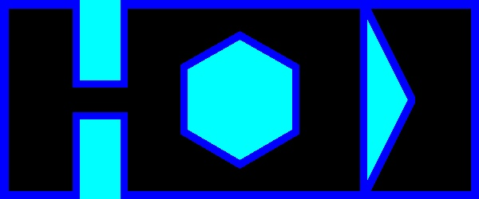

# ENPM-661-Project-3

## Phase 1
Mayank Sharma: 119203859
Yashveer Jain: 119252864

## Steps to run the code
```
python3 a_star_yashveer_mayank.py --StartPos 18 18 0 --GoalPos 200 230 0 --StepSize 5 --RobotRadius 5
```
* Arguments:
    - StartPos contains value
        - x in px value in map location
        - y in px value in map location
        - $\theta$ between range [0, 360].
    - GoalPos contains value
        - x in px value in map location
        - y in px value in map location
        - $\theta$ between range [0, 360].
    - StepSize
        - int value between range [1, 10]
    
    - RobotRadius
        - int value should be >=0.

* Output:
    - `map.jpg`: Image of the map
    - `node_exploration.mp4` : Video of the exploration of the robot, till it reach the goal.
    - `optimal_path.mp4` : Video of the exploration of the robot, till it reach the goal.
    
## Dependencies
* numpy
* matplotlib
* opencv-python

## Sample map


## Sample Video Link
- [node_exploration.avi](https://drive.google.com/file/d/1KrvCTZtGnLT8h5XbDSfJFU27FYaxpjMj/view?usp=sharing)
- [optimal_path.avi](https://drive.google.com/file/d/1oQWJR02fnb2DijqKrRnq-vcoDWiaARCk/view?usp=sharing)